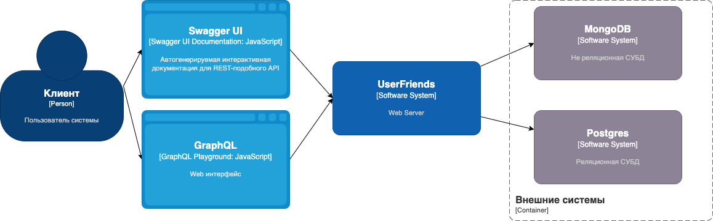

# Вариант реализации тестового задания от компании Ilink

> `NOTE:` в процессе реализации

✨ **This workspace has been generated by [Nx, a Smart, fast and extensible build system.](https://nx.dev)** ✨


## Архитектура



## Swagger Documentation

http://localhost:3333/api/rest

## GrapgQL playground

http://localhost:3333/graphql

## Development

### Запуск окружения

- запустить docker-compose

```bash
$dcoker-compose up
```

Run `yarn nx serve users-friends` for a dev server.

## Help Documentation

- [Nx Documentation](https://nx.dev)
- [NestJS Documentation](https://docs.nestjs.com)

<div align="center">


</div
